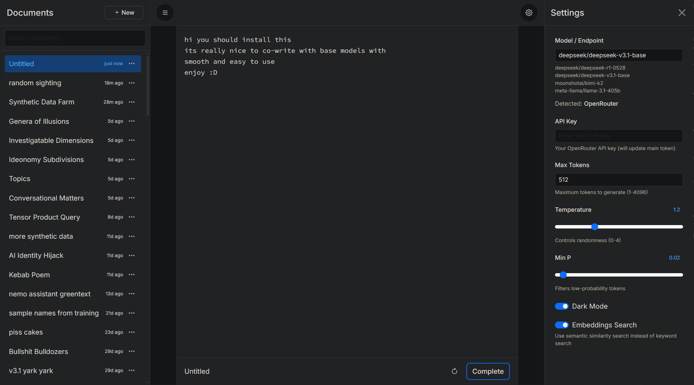

# text gen sandbox

A simple writing/editing app for using base LLMs in a classic-gpt3-like text sandbox. Edit and reroll completions as desired with no setup or interface friction, just a text box and unlimited format potential. Works great on mobile too!



## Quick Start

1. **Install Python** (3.7 or higher) if you haven't already
2. **Install the required packages**:
   ```bash
   pip install flask requests numpy model2vec
   ```
3. **Run the application**:
   ```bash
   python app.py
   ```
4. **Open your browser** and go to `http://127.0.0.1:5000`
5. **Optional:** Install [ngrok](https://download.ngrok.com/) and run `ngrok http 5000` to get a shareable link accessible on any device

### First Time Setup

1. Launch the server and browser as above (in Quick Start)
2. Click the sliders icon (top-right) to open Settings, if it's not already open
3. In the **Model/Endpoint** field, enter:
   - An OpenRouter model: `anthropic/claude-sonnet-4.5` or `moonshotai/kimi-k2::deepinfra/fp4`
   - A local/remote server: `http://localhost:1234/v1` or `https://your-tunnel.trycloudflare.com/v1`
4. Enter your API key (if using OpenRouter). You won't need to add it every launch - just the first one.
5. Adjust temperature, min_p, and max_tokens as desired. 

## Creating and Editing Content

**New Documents:**
- Click "New Document" in the sidebar
- Start typing in the editor

**Generating Completions:**
- Press `Ctrl+Enter` (or `Cmd+Enter`) to generate a completion from your current text
- The model will stream text directly into the editor
- Edit freely - the generated text is just text. It can be whatever you like - a poem, synthetic data jsonl, a conversation, a list, anything.

**Rerolling:**
- Click the reroll button (circular arrow) to undo the last generation and try again
- The editor reverts to the state before generation and immediately generates a new completion

**Seed Generation:**
- Click the seed button (leaf icon) to generate random starter text
- Works best on empty or near-empty documents - it replaces the entire contents of the current document. Don't worry - it will ask for confirmation on docs >1000 characters long.
- Renames the document to "Untitled" automatically

**Cancelling:**
- Click "Cancel" to stop an ongoing generation mid-stream. Rerolling or generating a seed also cancel any current gens.

### Managing Documents

Right-click any document for options: Rename, Duplicate, Download as .txt, Delete. Click the duplicate button (diagram icon) to copy the current document and switch to it - useful for quick variations or experiments. Proper branching/loom support is coming.

**Autorename:**
- Click "Autorename" in the rename dialog to generate a name from document content
- Documents titled "Untitled" are automatically renamed after generation. You can freely rename these anytime. They will not be further autorenamed.

**Search:**
- Use the search box in the sidebar
- Toggle "Embeddings Search" in settings to switch between semantic similarity (embeddings) or keyword matching
- Documents will be sorted as you type according to closest match, either by keyword count or embedding distance.

### Endpoints

**OpenRouter:**
- Enter any model in `provider/model-name` format: `anthropic/claude-sonnet-4.5`, `deepseek/deepseek-r1-0528`, `meta-llama/llama-3.1-405b`
- Get your API key from https://openrouter.ai/settings/keys
- Add it in the settings sidebar under "API Key"

**Provider Targeting (`::` syntax):**
- Force a specific backend on OpenRouter: `moonshotai/kimi-k2::deepinfra/fp4`
- Format: `model::provider` - useful when you want a specific host for speed/quality/cost
- The provider after `::` must be available for that model on OpenRouter

**OpenAI-Compatible Servers:**
- Enter any URL ending in `/v1`: `http://localhost:1234/v1`, `http://192.168.1.100:8080/v1`, `https://your-tunnel.trycloudflare.com/v1`
- Works with LM Studio, vLLM, llama.cpp server, text-generation-webui, tabbyAPI, etc.
- Can be local (`localhost`) or remote (LAN IP, cloudflare tunnel, ngrok, etc.)
- No API key needed for most local servers

**Auto-detection:**
- Starts with `http://` or `https://` → OpenAI-compatible server
- Everything else → OpenRouter model (invalid models will error when you generate, not when you enter them)
- **Important:** OpenAI-compatible URLs must end in `/v1` or the request will fail

## Contributing

Contributions are welcome! Feel free to submit issues and pull requests.


